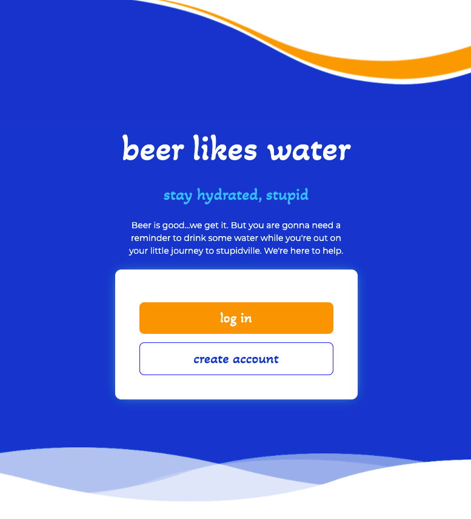

# beer likes water

## Description
An app that facilitates a responsible drinking experience by reminding you to stay properly hydrated while consuming alcohol.

## Requirements
  * Must use ReactJS in some way (even if minimal)
  * Must use a Node and Express Web Server
  * Must be backed by a MySQL or MongoDB Database with a Sequelize or Mongoose ORM  
  * Must have both GET and POST routes for retrieving and adding new data
  * Must be deployed using Heroku (with Data)
  * Must utilize at least two libraries, packages, or technologies that we haven’t discussed
  * Must allow for or involve the authentication of users in some way
  * Must have a polished frontend/UI 
  * Must have folder structure that meets MVC Paradigm
  * Must meet good quality coding standards (indentation, scoping, naming)
  * Must not expose sensitive API key information on the server

  ## Table of Contents
  * [Screenshot](#screenshot)
  * [Technologies](#technologies)
  * [Project URLs](#urls)
  * [Author](#author)

  ## Screenshot
  

   ## Technologies
  * HTML
  * CSS
  * Bootstrap
  * React
  * React-Bootstrap
  * Javascript
  * Heroku
  * MongoDB
  * Mongoose
  * Axios
  * Passport
  * Express

  ## URLs
  * Deployed App:
    https://polar-beach-07296.herokuapp.com/

  * Github Repo:
    https://github.com/evadllewop/be-like-water
 

  ## Author

  Dave Powell

  * [Github Profile](https://github.com/evadllewop)

